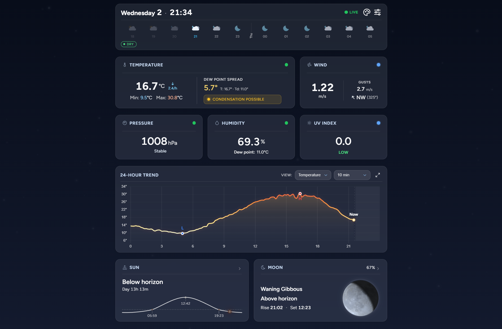
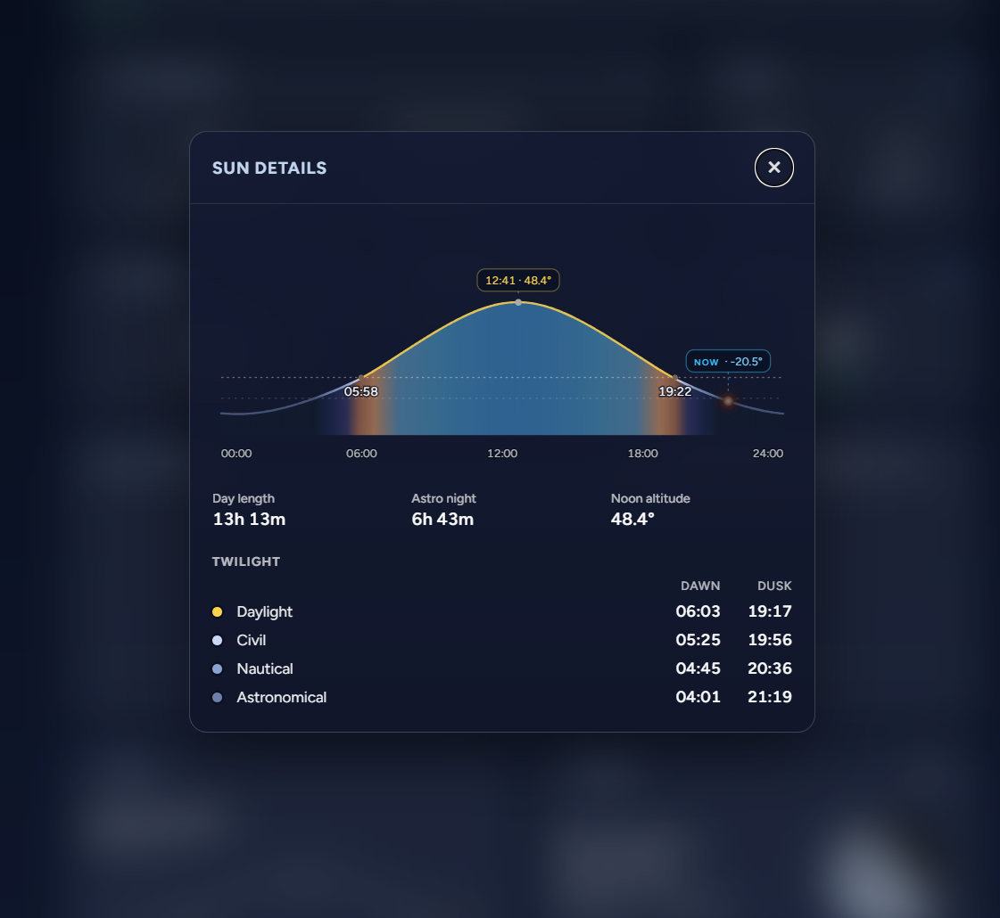
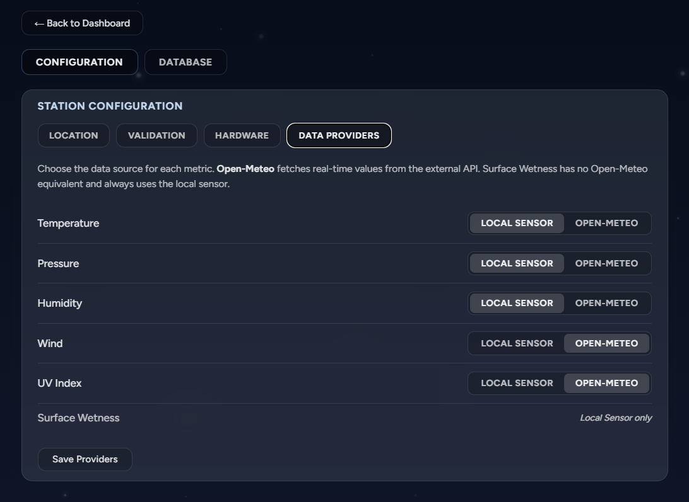

# Weather Station

A dashboard for a homemade backyard weather station.

A small sensor board in the garden publishes readings over MQTT; this app stores
them, checks them for nonsense, and puts them on a screen — alongside sun and
moon charts, a cloud forecast, and history going back a month. Metrics you don't
have hardware for can be filled in from a free weather API instead, so a station
with one thermometer still gets a complete dashboard.

Built for **one station in one place**. It is a personal project, not a product.

<p align="center">
  
</p>

<p align="center">
  
  
</p>

## Features

- **Live dashboard** — temperature, pressure, humidity, dew point, wind, UV and
  surface wetness, refreshed every 30 seconds
- **Mix your own sensors with an API** — each metric independently comes from your
  hardware or from Open-Meteo, switchable at runtime
- **Sun and moon** — a whole-day altitude chart with twilight shading, moon phase
  with a rendered disc, rise and set countdowns
- **Cloud forecast strip** — cloud cover and conditions for the hours ahead
- **History** — hourly and daily charts with a date picker
- **Knows when a reading is wrong** — spikes and out-of-range values are flagged
  rather than silently plotted, and a 24-hour strip shows whether each sensor has
  been healthy
- **Looks after itself** — readings roll up into hourly and daily summaries, and
  raw data is pruned after 30 days
- **Admin panel** — location, sensor calibration and data sources, all without a
  restart

## How it works

```
your sensor  ──MQTT──▶  Weather Station  ──▶  PostgreSQL
                              │
Open-Meteo  ─────────────────▶│──▶  dashboard in your browser
```

Readings arrive over MQTT and are checked before they are stored — a value far
from the recent median is marked as a spike, one outside a plausible range as an
anomaly. Nothing is thrown away; bad readings are kept and labelled.

Metrics you have no sensor for are fetched from Open-Meteo instead and rendered
identically, so the dashboard looks the same either way.

Sun and moon positions are calculated on the spot from your coordinates, not
downloaded, so that half of the dashboard works with no internet at all.

Every night the raw readings are folded into hourly and daily summaries and
anything older than 30 days is deleted, which keeps the database from growing
forever.

## Running with Docker

Images are published for `amd64` and `arm64`, so the same tag runs on a Raspberry
Pi or a normal machine.

**If you have nothing set up yet** — this brings its own database and broker:

```bash
cp .env.example .env      # set the two passwords
docker compose -f docker-compose.yml -f docker-compose.full.yml up -d
```

**If you already run PostgreSQL and MQTT** — put your settings in
`config/application-local.yml` and:

```bash
docker compose pull && docker compose up -d
```

Then open `http://localhost:8080`.

Building it yourself, updating, verifying and troubleshooting are all in the
**[Docker reference](docs/docker.md)**.

## Configuration

Once it is running, everything about the station is set at `/admin/config.html`
and takes effect immediately — no restart:

- **Where you are** — coordinates drive both the forecast and every sun and moon
  calculation, so they are worth getting right
- **Where each metric comes from** — your sensor, or the API
- **What counts as a bad reading** — plausible ranges and spike limits
- **Sensor calibration** — wetness sensor baselines, hardware labels

Full details of every setting: **[Configuration](docs/configuration.md)**.

## Connecting a sensor

Your board publishes one JSON object per reading to the MQTT topic:

```json
{
  "deviceId": "station-1",
  "temperature": 21.5,
  "pressure": 1013.2,
  "humidity": 55.0
}
```

Only `deviceId` is required. **Leave out the fields you have no sensor for** —
that is how the dashboard knows the difference between hardware you never fitted
and hardware that has failed, and it is the difference between a clean dashboard
and one that looks broken.

Field names, units, and what sending `null` means: **[Sensor protocol](docs/sensor-protocol.md)**.

## Limitations

Worth knowing before you rely on it:

- **One station, one user.** No multi-site or multi-account support, and a single
  admin login. CSRF is disabled — fine for a personal deployment, not for a
  shared one.
- **No HTTPS of its own.** Put a reverse proxy in front of it for anything
  reachable from outside your network.
- **Readings can be lost.** If the broker or database is down, whatever arrives
  meanwhile is gone — there is no queue or replay.
- **API metrics are hourly**, not live, and are not quality-checked.
- **Raw data lasts 30 days.** After that only hourly and daily summaries remain.
- **Seeing quality is an estimate** from a turbulence model, useful for planning
  a night, not a substitute for a real seeing monitor.
- **Partial test coverage.** No end-to-end or frontend tests.

## Development

Running from source, building, testing and database migrations:
**[Development](docs/development.md)**.

Architecture, module layout and internals: `CLAUDE.md`.

## Tech stack

| Layer | Technology |
|---|---|
| Backend | Spring Boot 4.0.5 / Java 25 |
| Database | PostgreSQL + Flyway migrations |
| ORM | Spring Data JPA / Hibernate |
| Messaging | Eclipse Paho MQTT client |
| External API | Open-Meteo (free, no API key required) |
| Astronomy | cosinekitty astronomy library |
| Frontend | Thymeleaf + vanilla JS (ES modules), Chart.js |
| Security | Spring Security (form login + HTTP Basic, single admin user) |
| Code gen | Lombok, MapStruct |
| Caching | Caffeine (in-memory) |

## License

MIT — see [LICENSE](LICENSE).
